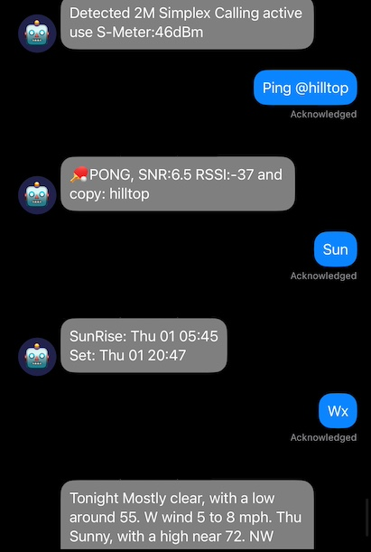

# Hessenbot

**Hessenbot** ist ein Meshtastic-Autoresponder-Bot für den deutschsprachigen Raum — ein Fork von [SpudGunMan/meshing-around](https://github.com/SpudGunMan/meshing-around) (`main`).

Der Bot antwortet auf Mesh-Befehle per Text, bietet BBS, Wetter, NINA/Katwarn-Warnungen, ein Web-Dashboard und weitere Werkzeuge für Netzwerk und Community. Spiele, US-Warnsysteme (NOAA/FEMA/USGS) und das alte `modules/web`-Frontend wurden in diesem Fork entfernt; der Fokus liegt auf **EU/DE** und dem eigenen Flask-Portal unter `static/portal/`.



## Danksagung / Acknowledgements

Dieses Projekt wäre ohne die Arbeit von **Kelly Keeton (K7MHI)** und allen Mitwirkenden an [**meshing-around**](https://github.com/SpudGunMan/meshing-around) nicht entstanden. Herzlichen Dank für den umfangreichen Open-Source-Bot, die Module, Dokumentation und die Community rund um Meshtastic.

Wenn du den Original-Bot mit vollem Funktionsumfang (Spiele, US-Alerts, …) suchst, nutze bitte das Upstream-Repository:

- Upstream: https://github.com/SpudGunMan/meshing-around  
- Fork-Basis: Branch `main` von meshing-around

Weitere Inspiration und Credits aus dem Original finden sich unten unter [Credits (Upstream)](#credits-upstream).

## Schnellstart

| Thema | Link |
|--------|------|
| Installation | [INSTALL.md](INSTALL.md) |
| Konfiguration | [config.template](config.template) → `config.ini` |
| Modul-Details | [modules/README.md](modules/README.md) |

```sh
git clone https://github.com/chrishaef/Hessenbot.git
cd Hessenbot
cp config.template config.ini
# config.ini anpassen, dann:
./bootstrap.sh   # oder install.sh — siehe INSTALL.md
./launch.sh mesh
```

## Was dieser Fork auszeichnet

### Deutschland / EU
- **NINA / Katwarn / DWD** über [warnung.bund.de](https://warnung.bund.de): `!warning` (Standort der anfragenden Node), `!dealert` (konfigurierte Regionen), optional automatischer Broadcast
- **Wetter** über **Open-Meteo** (`!wx`, `!wxc`) — Standard in `config.template`
- **Standort & Karte**: `whereami`, `howfar`, `map`, Repeater-Listen, gespeicherte Orte

### Web-UI (Flask)
- Öffentliches **Statistik-Dashboard** (`/`)
- **Admin-Backend** (`/admin`): BBS, Logs, MOTD, Scheduler, NodeDB, News/Alert-Dateien
- Assets: `static/portal/` (Charts, NodeDB-Suche, BBS-Ansichten)
- Aktivierung: `[webAdmin] enabled = True` in `config.ini` (siehe [config.template](config.template))

### Kernfunktionen (aus meshing-around, beibehalten)
- Keyword-Responder (`!ping`, `!cmd`, …), Notfall-Stichwörter (112, …)
- **BBS** (Posten, Lesen, DM, Link zwischen Bots)
- **LLM** (Ollama / OpenWebUI, optional)
- **Solar / HF** (`!solar`, `!hfcond`, `!sun`, `!moon`)
- Scheduler, File-Monitor, Sentry-Nähe, QRZ-Begrüßung, Inventar/Checklist (optional)
- Multi-Interface (bis zu 9 Radios), Nachrichten-Chunking (160 Zeichen)

## Wichtige Mesh-Befehle (Auswahl)

| Befehl | Beschreibung |
|--------|----------------|
| `!cmd` | Befehlsliste |
| `!ping` / `!ack` | Erreichbarkeitstest |
| `!warning` | NINA/Katwarn für **deinen** Standort (GPS der Node) |
| `!dealert` | Warnungen für in `myRegionalKeysDE` eingetragene Regionen |
| `!wx` / `!wxc` | Wetter (Open-Meteo) |
| `!whereami` / `!whoami` | Standort / Node-Info |
| `!bbslist`, `!bbspost`, … | Bulletin Board |

Voraussetzungen in `config.ini`: u. a. `[location] enabled = True`, `enableDEalerts = True`, `UseMeteoWxAPI = True`, `cmdBang = True`.

## Was in diesem Fork **nicht** mehr enthalten ist

- Spiele (Blackjack, DopeWars, Quiz, …) und `modules/games/`
- US-/UK-Alerts (NOAA EAS, FEMA iPAWS, USGS, UK-Scraper)
- Legacy-Webserver `modules/web.py` und `etc/www/` (Port 8420)
- `launch.sh game` / Display-Spiele

## Entwicklung & Plattform

Entwicklung und Betrieb typischerweise auf **Linux** (z. B. Raspberry Pi) mit aktueller **Meshtastic-Firmware**. Python **3.8+**; Abhängigkeiten: [requirements.txt](requirements.txt).

Bitte verantwortungsvoll nutzen und lokale Vorschriften für Funk/Meshtastic beachten. Der Bot protokolliert Traffic und kann Positionsdaten verarbeiten.

### Docker

Siehe [script/docker/README.md](script/docker/README.md).

### MQTT

Wie im Upstream: kein dedizierter MQTT-Code; Nutzer berichten von Betrieb über `meshtasticd` + MQTT-verknüpfte Software-Nodes. Siehe [Meshtastic MQTT-Doku](https://meshtastic.org/docs/software/integrations/mqtt/mosquitto/).

### Firmware: DM-Keys & Favoriten

Ab Firmware 2.6: PKC/DM-Keys — Favoriten für BBS-Admins setzen (`script/addFav.py`, `favoriteNodeList` in `config.ini`). Details im Upstream-README und [INSTALL.md](INSTALL.md).

## Tests

```sh
python3 modules/test_bot.py
# Optionale API-Tests (Netzwerk):
touch .checkall && python3 modules/test_bot.py
```

## Credits (Upstream)

Übernommen und gekürzt aus dem Original-README von meshing-around.

### Inspiration
- [MeshLink](https://github.com/Murturtle/MeshLink)
- [Meshtastic Python Examples](https://github.com/pdxlocations/meshtastic-Python-Examples)
- [Meshtastic Matrix Relay](https://github.com/geoffwhittington/meshtastic-matrix-relay)

### Tools
- [Node Slurper](https://github.com/SpudGunMan/node-slurper) (Node-Backup)

Meshtastic® ist eine eingetragene Marke von Meshtastic LLC. Die Meshtastic-Softwarekomponenten stehen unter verschiedenen Lizenzen — siehe GitHub. **Keine Gewährleistung — Nutzung auf eigenes Risiko.**
