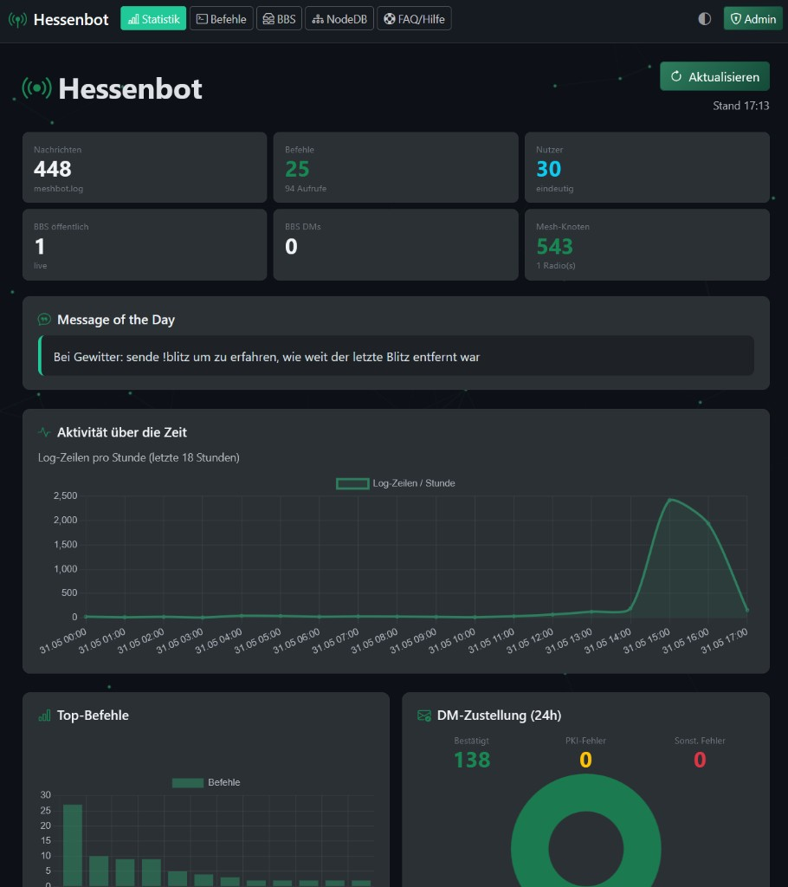
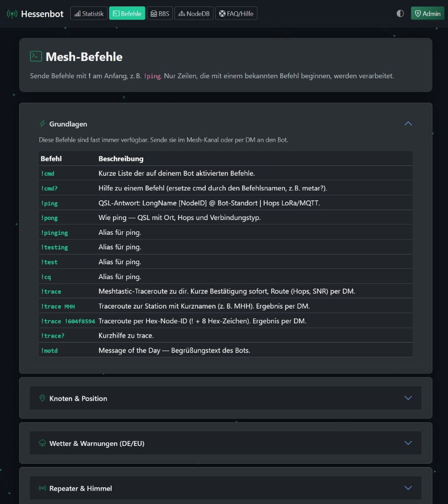
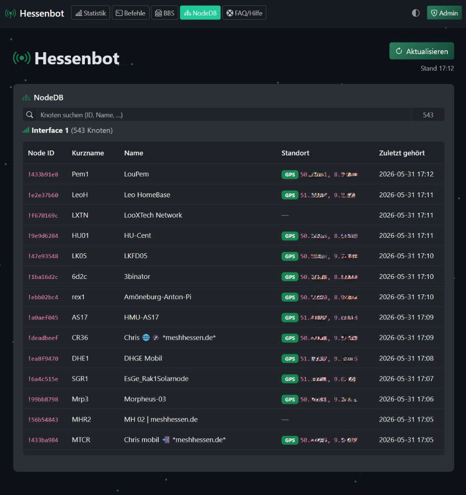
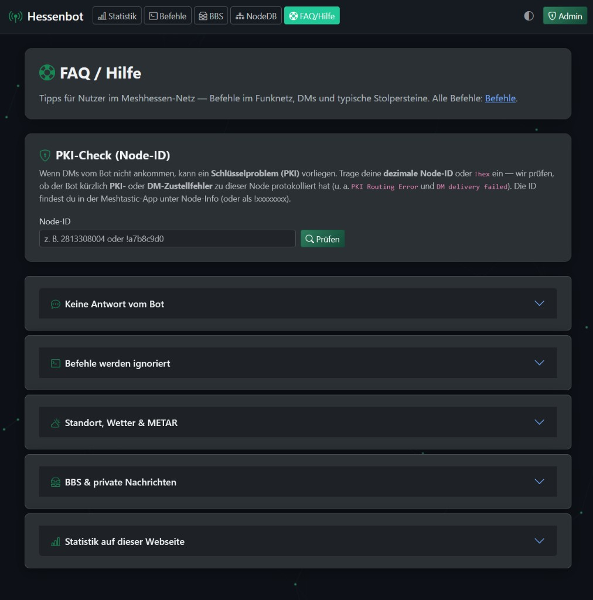
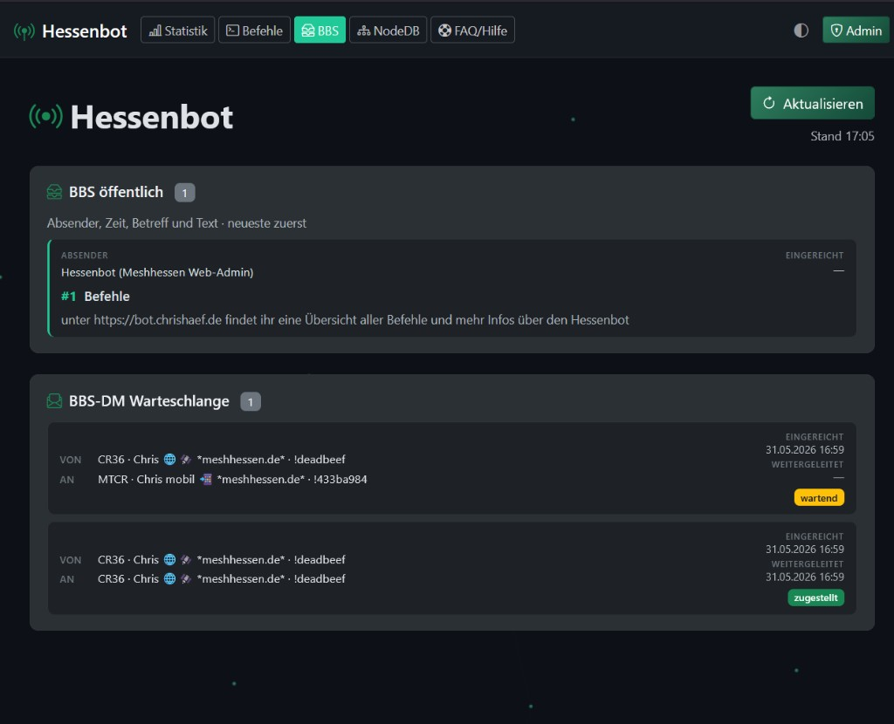
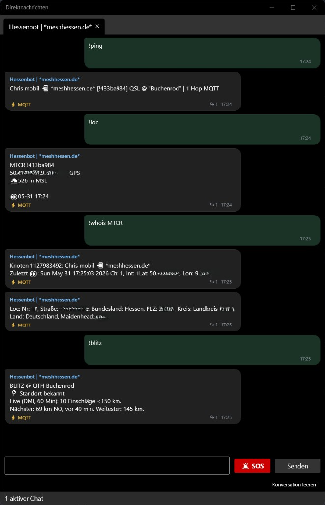
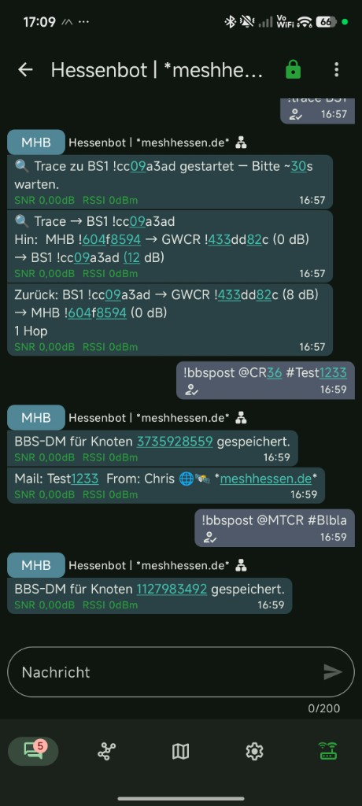
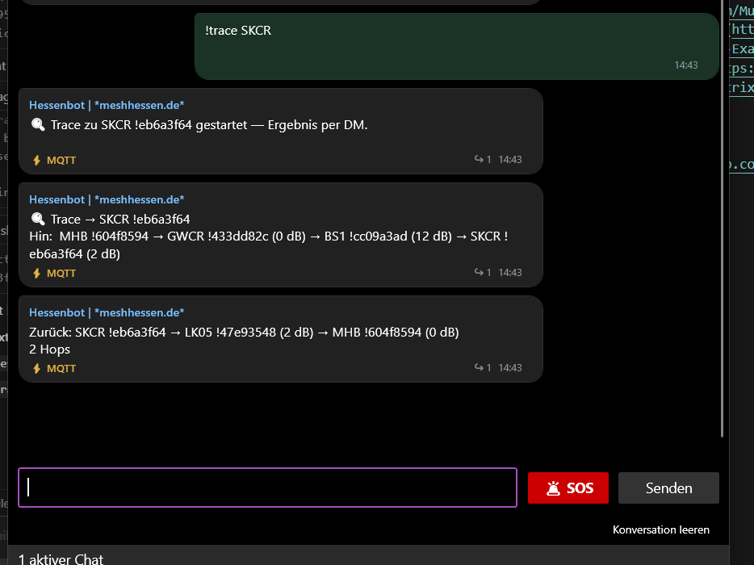
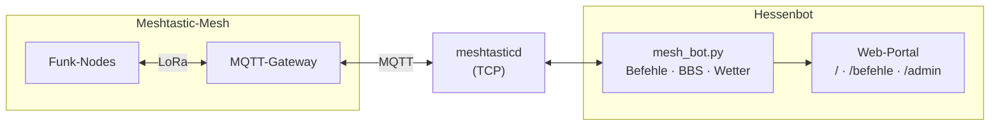

# Hessenbot

**Hessenbot** ist ein Meshtastic-Autoresponder für [Meshhessen](https://meshhessen.de) — ein Fork von [SpudGunMan/meshing-around](https://github.com/SpudGunMan/meshing-around) (`main`).

Der Bot antwortet auf Mesh-Befehle (meist mit `!` am Anfang, per DM), bietet BBS, Wetter, Blitz/Unwetter, NINA/Katwarn-Warnungen, Traceroute, DM-Zustellüberwachung, ein Web-Dashboard und Werkzeuge für Netz und Community. Spiele, US-Warnsysteme (NOAA/FEMA/USGS) und das alte `modules/web`-Frontend wurden entfernt; der Fokus liegt auf **EU/DE** und dem Flask-Portal unter `static/portal/`.

## Screenshots

### Web-Portal



| `/befehle` | `/nodedb` | `/faq` | `/bbs` |
|:---:|:---:|:---:|:---:|
|  |  |  |  |

Öffentlich unter `/`, `/befehle`, `/nodedb`, `/faq`, `/bbs` — Admin-Login unter `/admin`.

### Mesh: Befehle & Trace



`!ping`, `!loc`, `!whois`, `!blitz` im Web-Admin (DM-Chat) — inkl. Hop-Anzeige bei MQTT-Gateways.

| Meshtastic-App (DM) | Web-Admin (DM-Chat) |
|:---:|:---:|
|  |  |
| `!trace` + `!bbspost` im Funk-Client | `!trace` im Admin-DM-Tab |



## Danksagung / Acknowledgements

Dieses Projekt wäre ohne **Kelly Keeton (K7MHI)** und alle Mitwirkenden an [**meshing-around**](https://github.com/SpudGunMan/meshing-around) nicht entstanden.

- Upstream: https://github.com/SpudGunMan/meshing-around  
- Fork-Basis: Branch `main` von meshing-around

Weitere Credits unten unter [Credits (Upstream)](#credits-upstream).

## Schnellstart

| Thema | Link |
|--------|------|
| Installation | [INSTALL.md](INSTALL.md) |
| Konfiguration | [config.template](config.template) → `config.ini` |
| Modul-Details | [modules/README.md](modules/README.md) |
| Befehlsreferenz (Web) | `/befehle` am laufenden Portal |
| FAQ | `/faq` am laufenden Portal |

```sh
git clone https://github.com/chrishaef/Hessenbot.git
cd Hessenbot
cp config.template config.ini
# config.ini anpassen (UTF-8), dann:
./bootstrap.sh   # oder install.sh — siehe INSTALL.md
./launch.sh mesh
```

**Wichtig für Meshhessen:** Der Bot ignoriert in der Regel den öffentlichen Standardkanal (ShortSlow). Befehle im **regionalen Kanal 1** (`#1MeshHessen`) senden oder als **DM** an den Bot.

## Was dieser Fork auszeichnet

### Meshhessen / Deutschland

- Betrieb im regionalen Kanal **1**; `defaultChannel` (oft 0 = ShortSlow) wird typischerweise **nicht** bedient (`ignoreDefaultChannel = True` in `config.template`)
- **NINA / Katwarn / DWD** über [warnung.bund.de](https://warnung.bund.de): `!warning`, `!dealert`, optional Broadcast
- **Wetter** über **Open-Meteo**: `!wx`, `!wxc`, `!uv`, `!regen`, `!blitz`
- **METAR** (`!metar`, optional ICAO): nächstgelegener Flughafen
- **Standort**: `!whereami`, `!loc` (mit Höhe), `!howfar`, `!map`, Repeater (`!rlist`)
- **Standort-Auflösung** (für Wetter, Warnungen, Blitz): zuerst frische NodeDB-Position (≤ 24 h), dann [Mesh-Karte](https://map.meshhessen.de), sonst Bot-Standort aus `config.ini`

### Ping, Trace & DM-Zustellung

- **`!ping` / `!pong` / `!test` / `!ack` / `!cq`**: QSL-Antwort im Format  
  `LongName [!nodeid] QSL @ "Ort" | N Hops LoRa|MQTT`
- **Hop-Anzeige bei MQTT-Gateways:** Für über MQTT getunnelte Pakete werden Hops aus NodeDB, Trace-Cache und Paket-Metadaten aufgelöst — nicht mehr pauschal „0 Hops MQTT“.
- **`!trace` / `!trace MHH` / `!trace !604f8594`**: Meshtastic-Traceroute zum Bot bzw. Ziel; Ergebnis (Hin- und Rückweg) per **DM**. Globale Warteschlange (ein Trace gleichzeitig), ~65 s Abstand pro Funk-Interface.
- **Channel-Test** (optional): Auf konfigurierten Kanälen antwortet der Bot auf ein nacktes **`test`** / **`Test`** (ohne `!`) **direkt im Kanal** — gleiche Antwort wie `!test`. Ein-/Aus-Schaltung und Kanalauswahl im Web-Admin (Tab **Channel-Test**). Alle anderen Befehle bleiben unverändert (DM und/oder `!`).
- **`wantAckOnDm`**: Mesh-ACK auf DM-Antworten; Fehlzustellungen (inkl. PKI) werden geloggt und im Admin/Dashboard ausgewertet
- Konfiguration: `[messagingSettings]` in `config.ini` (`wantAckOnDm`, `dmDeliveryFailAlertThreshold`)

### Blitz (`!blitz`)

- Live-Einschläge (DMI, optional Blitzortung.org) + kurze Modell-Vorhersage (Open-Meteo)
- Ausgabe: Anzahl Einschläge, **Nächster**, **Weitester** und **Letzter** (zeitlich neuester) mit Distanz und Himmelsrichtung
- Standort der anfragenden Station; in der Antwort wird angezeigt, ob der Standort bekannt ist oder der Bot-Standort genutzt wird

### Web-UI (Flask)

| URL | Inhalt |
|-----|--------|
| `/` | Öffentliches Statistik-Dashboard (Charts, BBS, NodeDB, Leaderboard 24h, DM-Zustellung 24h) |
| `/befehle` | Befehlsliste inkl. `!trace` |
| `/faq` | Hilfe & PKI-Check |
| `/admin` | Login: BBS, DM, Logs, MOTD, Scheduler, News, NodeDB, Node Settings, Channel-Test, Einstellungen, … |

**Öffentliches Dashboard:** Metriken, Aktivitätscharts, Leaderboard (24-Stunden-Ansicht), BBS, NodeDB — ohne interne Log-Warnungen/Fehler-Kacheln.

**Admin-Bereich** (Tabs): Übersicht, DM, News, Messages, NodeDB, **Node Settings**, Admin, MOTD, Scheduler, **Channel-Test**, BBS, Umfragen, Einstellungen, Banliste, Logs.

- **MOTD** und **News**: Text bearbeiten plus automatischer Versand (Rhythmus, Kanal, Interface) — unabhängig vom allgemeinen Scheduler
- **Scheduler**: geplante Nachrichten oder Aktionen (Wetter, News, Sysinfo, …)
- **Node Settings**: Einstellungen der verbundenen Meshtastic-Node (Name, Broadcast-Intervalle, feste Position — kein GPS am Bot)
- Einheitliche **Top-Navigation** (Statistik, Befehle, BBS, NodeDB, FAQ) in öffentlichem und Admin-Bereich
- Aktivierung: `[webAdmin] enabled = True` (siehe [config.template](config.template))

### Kernfunktionen (aus meshing-around, beibehalten)

- Keyword-Responder, Notfall-Stichwörter (112, …)
- **BBS** (Posten, Lesen, DM, Link zwischen Bots)
- **LLM** (Ollama / OpenWebUI, optional)
- **Solar / HF** (`!solar`, `!hfcond`, `!sun`, `!moon`, `!howtall`)
- Scheduler, File-Monitor (`!readnews`), Sentry-Nähe, QRZ-Begrüßung, Inventar/Checklist (optional)
- Multi-Interface (bis zu 9 Radios), Nachrichten-Chunking (160 Zeichen)
- **Store & Forward**: `!messages` — letzte Nachrichten von Kanal 1 (`messagesChannel`, `messagesLimit` in `[general]`)
- **Umfragen** (`!poll`, Web-Admin)

## Wichtige Mesh-Befehle (Auswahl)

| Befehl | Beschreibung |
|--------|----------------|
| `!cmd` | Kurze Befehlsliste (aktivierte Traps) |
| `!ping` / `!pong` / `!test` | QSL mit Ort, Hops, LoRa/MQTT |
| `!trace` / `!trace MHH` | Traceroute zu dir bzw. Ziel-Station (Ergebnis per DM, Warteschlange) |
| `!trace?` | Kurzhilfe zu `!trace` |
| `test` (ohne `!`) | Nur auf aktivierten Kanälen (Channel-Test): Antwort wie `!test`, direkt im Kanal |
| `!ack` | Wie Ping, Keyword ACK |
| `!warning` | NINA/Katwarn für **deinen** Standort |
| `!dealert` | Warnungen für `myRegionalKeysDE` |
| `!wx` / `!wxc` | Wetter (Open-Meteo) |
| `!uv` / `!regen` / `!blitz` | UV-Index, Regenradar, Blitz (Live + Vorhersage) |
| `!metar` / `!metar EDDF` | METAR nächster Flughafen bzw. ICAO |
| `!whereami` | Ortsname (Geocoding) + Höhe falls übertragen |
| `!loc` | Letzte Position eines Knotens (NodeDB / Mesh-Karte) inkl. Höhe |
| `!howfar` / `!howfar reset` | Zurückgelegte Strecke seit letztem Aufruf |
| `!howtall <Schatten>` | Höhe per Sonnenwinkel (Schattenlänge in m/ft) |
| `!messages` | Letzte Nachrichten von Kanal 1 (ohne Bot-Befehle) |
| `!readnews` | News aus `data/news.txt` (oder `{quelle}_news.txt`) |
| `!bbslist`, `!bbspost`, … | Bulletin Board |
| `!poll` | Umfragen |

Voraussetzungen in `config.ini` (Auszug):

```ini
[general]
defaultChannel = 0
ignoreDefaultChannel = True
messagesChannel = 1
messagesLimit = 5
cmdBang = True

[location]
enabled = True
enableDEalerts = True
UseMeteoWxAPI = True

[messagingSettings]
wantAckOnDm = True
dmDeliveryFailAlertThreshold = 3

[channelTest]
enabled = False
channels =

[motdBroadcast]
enabled = False

[newsBroadcast]
enabled = False

[fileMon]
enable_read_news = True
news_file_path = data/news.txt

[webAdmin]
enabled = True
```

`cmdBang = True` — normale Befehle beginnen mit `!`. Ausnahme: **Channel-Test** (siehe oben).

## Was in diesem Fork **nicht** mehr enthalten ist

- Spiele (Blackjack, DopeWars, Quiz, …) und `modules/games/`
- US-/UK-Alerts (NOAA EAS, FEMA iPAWS, USGS, UK-Scraper)
- Legacy-Webserver `modules/web.py` und `etc/www/` (Port 8420)
- `launch.sh game` / Display-Spiele

## Entwicklung & Plattform

Entwicklung und Betrieb typischerweise auf **Linux** (z. B. Raspberry Pi) mit aktueller **Meshtastic-Firmware**. Python **3.8+**; Abhängigkeiten: [requirements.txt](requirements.txt).

`config.ini` muss **UTF-8** sein (keine Windows-1252-Kommentare), sonst bricht der Start ab.

Bitte verantwortungsvoll nutzen und lokale Vorschriften für Funk/Meshtastic beachten. Der Bot protokolliert Traffic und kann Positionsdaten verarbeiten.

### Docker

Siehe [script/docker/README.md](script/docker/README.md).

### MQTT

Wie im Upstream: kein dedizierter MQTT-Code; Betrieb über `meshtasticd` + MQTT-verknüpfte Software-Nodes ist möglich. Siehe [Meshtastic MQTT-Doku](https://meshtastic.org/docs/software/integrations/mqtt/mosquitto/).

### Firmware: DM-Keys & Favoriten

Ab Firmware 2.6: PKC/DM-Keys — Favoriten für BBS-Admins (`script/addFav.py`, `favoriteNodeList`). Details in [INSTALL.md](INSTALL.md) und `/faq` (PKI-Check).

## Tests

```sh
python3 modules/test_bot.py
# Optionale API-Tests (Netzwerk):
touch .checkall && python3 modules/test_bot.py
```

## Lizenz & Haftung

Meshtastic® ist eine eingetragene Marke von Meshtastic LLC. Die Meshtastic-Softwarekomponenten stehen unter verschiedenen Lizenzen — siehe GitHub. **Keine Gewährleistung — Nutzung auf eigenes Risiko.**

## Credits (Upstream)

### Inspiration

- [MeshLink](https://github.com/Murturtle/MeshLink)
- [Meshtastic Python Examples](https://github.com/pdxlocations/meshtastic-Python-Examples)
- [Meshtastic Matrix Relay](https://github.com/geoffwhittington/meshtastic-matrix-relay)

### Tools

- [Node Slurper](https://github.com/SpudGunMan/node-slurper) (Node-Backup)
