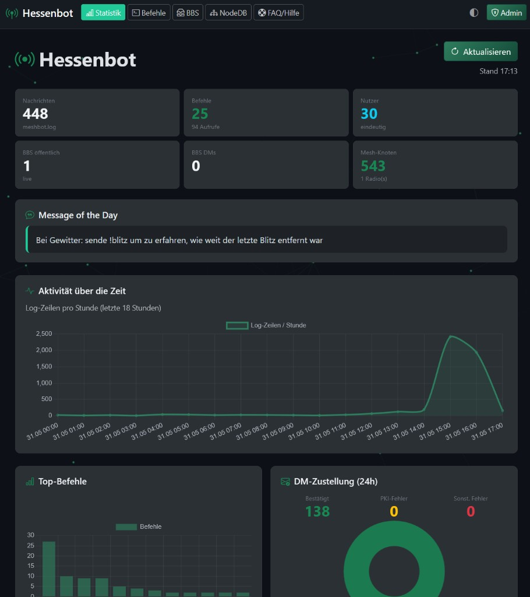
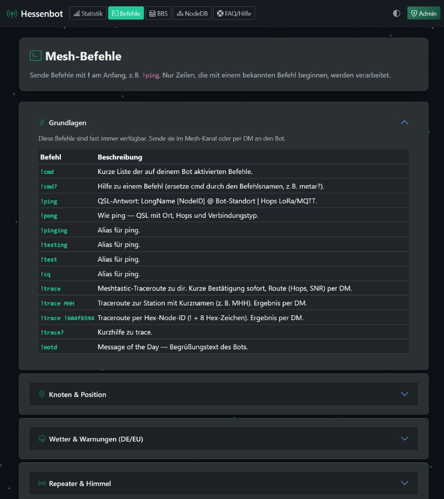
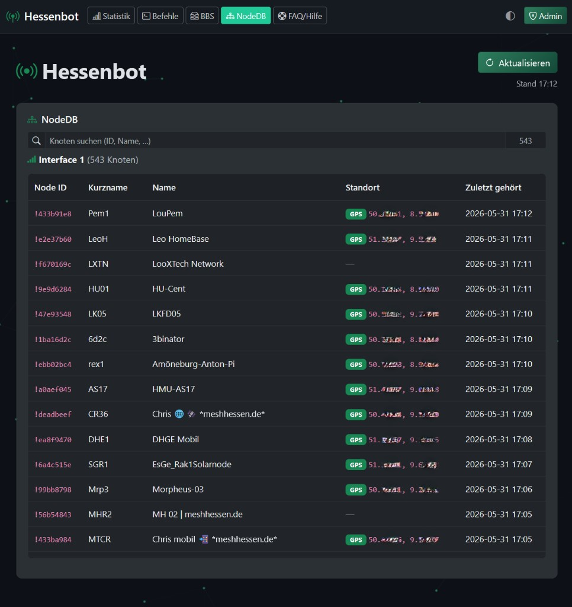
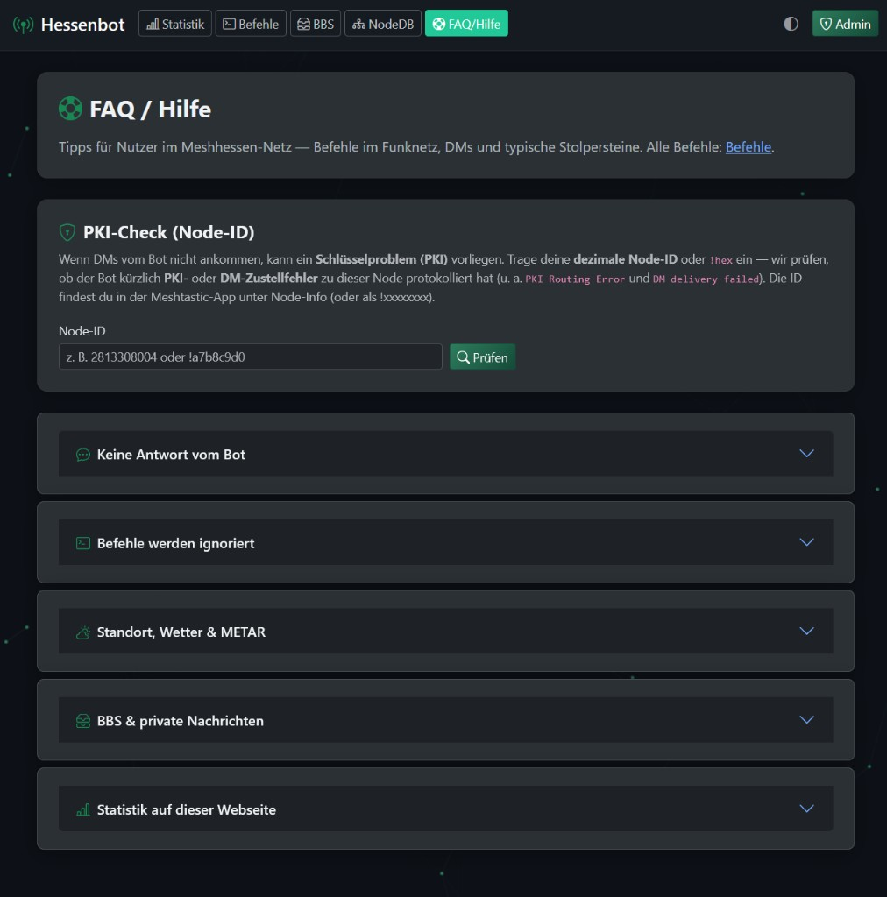
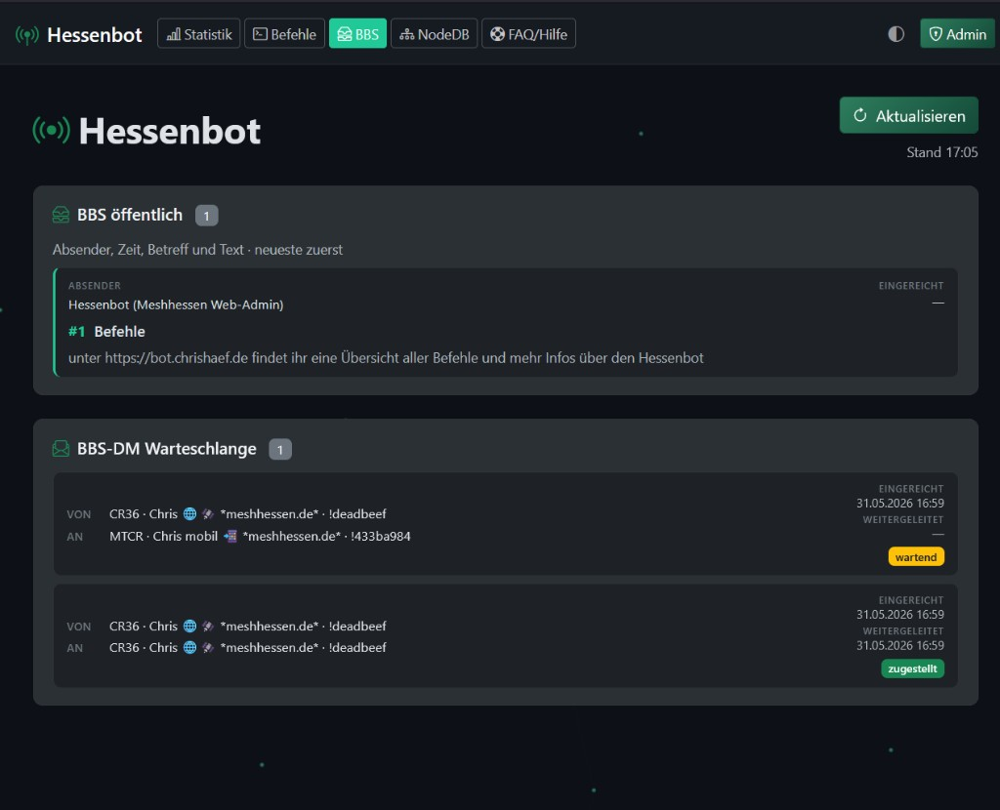
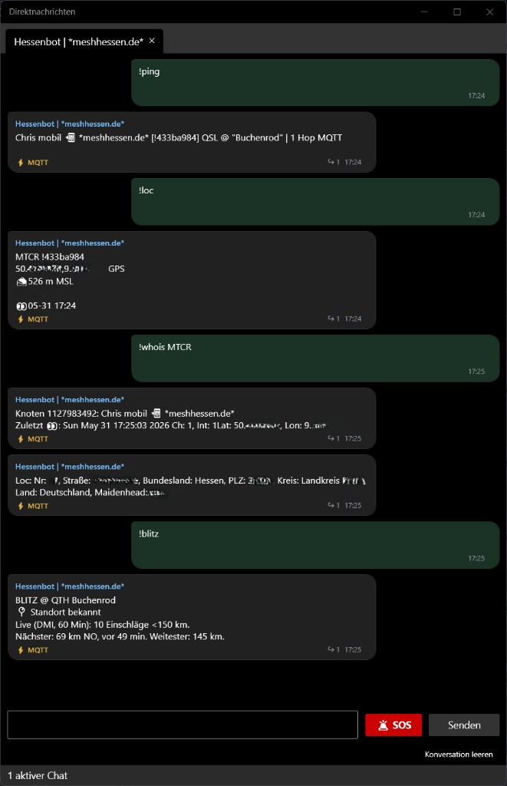
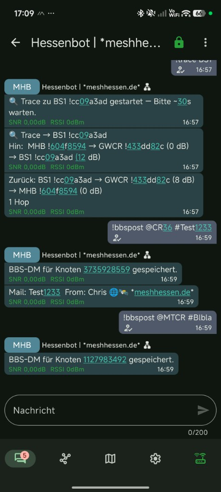
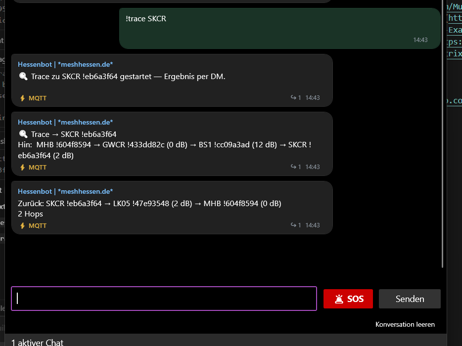
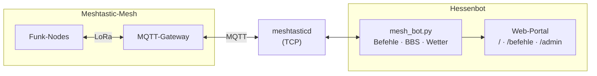

# Hessenbot

**Hessenbot** ist ein Meshtastic-Autoresponder für [Meshhessen](https://meshhessen.de) — ein Fork von [SpudGunMan/meshing-around](https://github.com/SpudGunMan/meshing-around) (`main`).

Der Bot antwortet auf Mesh-Befehle (meist mit `!` am Anfang, per DM), bietet BBS, Wetter, Blitz/Unwetter, NINA/Katwarn-Warnungen, Traceroute, DM-Zustellüberwachung, ein Web-Dashboard und Werkzeuge für Netz und Community. Der Fokus liegt auf **EU/DE** und dem Flask-Portal unter `static/portal/`.

## Screenshots

### Web-Portal



| `/befehle` | `/nodedb` | `/faq` | `/bbs` |
|:---:|:---:|:---:|:---:|
|  |  |  |  |

Öffentlich unter `/`, `/befehle`, `/mein-blitzwatch`, `/faq`, `/impressum`, `/datenschutz` — Admin-Login unter `/admin`.

### Mesh: Befehle & Trace

Screenshots aus dem **[Meshhessen Windows Client](https://github.com/SMLunchen/mh_windowsclient)** (Community-Meshtastic-Client für Windows) bzw. der **Meshtastic-App** (Android) — jeweils per DM.



`!ping`, `!loc`, `!whois`, `!blitz` im Meshhessen Windows Client — inkl. Hop-Anzeige bei MQTT-Gateways.

| Meshtastic-App (Android, DM) | Meshhessen Windows Client (DM) |
|:---:|:---:|
|  |  |
| `!trace` + `!bbspost` | `!trace` |


```mermaid
flowchart LR
  subgraph Mesh["Meshtastic-Mesh"]
    Radio["Funk-Nodes"]
    GW["MQTT-Gateway"]
  end
  subgraph Bot["Hessenbot"]
    Flask["Web-Portal\n/ · /befehle · /admin"]
    Core["mesh_bot.py\nBefehle · BBS · Wetter"]
  end
  MD["meshtasticd\n(TCP)"]
  Radio <-- LoRa --> GW
  GW <-- MQTT --> MD
  MD <--> Core
  Core --> Flask
```

## Danksagung / Acknowledgements

Dieses Projekt wäre ohne **Kelly Keeton (K7MHI)** und alle Mitwirkenden an [**meshing-around**](https://github.com/SpudGunMan/meshing-around) nicht entstanden.

- Upstream: https://github.com/SpudGunMan/meshing-around  
- Fork-Basis: Branch `main` von meshing-around

Weitere Credits unten unter [Credits (Upstream)](#credits-upstream).

## Schnellstart

| Thema | Link |
|--------|------|
| Installation | [INSTALL.md](INSTALL.md) |
| Konfiguration | [config.template](config.template) → `config.ini` |
| Modul-Details | [modules/README.md](modules/README.md) |
| Mitwirken | [CONTRIBUTING.md](CONTRIBUTING.md) |
| Sicherheit | [SECURITY.md](SECURITY.md) |
| Änderungen | [CHANGELOG.md](CHANGELOG.md) |
| Befehlsreferenz (Web) | `/befehle` am laufenden Portal |
| FAQ | `/faq` am laufenden Portal |

```sh
git clone https://github.com/chrishaef/Hessenbot.git
cd Hessenbot
cp config.template config.ini
# config.ini anpassen (UTF-8), dann:
./bootstrap.sh   # oder install.sh — siehe INSTALL.md
./launch.sh mesh
```

**Wichtig für Meshhessen:** Der Bot ignoriert in der Regel den öffentlichen Standardkanal (ShortSlow). Befehle im **regionalen Kanal 1** (`#1MeshHessen`) senden oder als **DM** an den Bot.

## Was dieser Fork auszeichnet

### Meshhessen / Deutschland

- Betrieb im regionalen Kanal **1**; `defaultChannel` (oft 0 = ShortSlow) wird typischerweise **nicht** bedient (`ignoreDefaultChannel = True` in `config.template`)
- **NINA / Katwarn / DWD** über [warnung.bund.de](https://warnung.bund.de): `!warning`, `!dealert`, optional Broadcast
- **Wetter** über **Open-Meteo**: `!wx`, `!wxc`, `!uv`, `!regen`, `!blitz`
- **METAR** (`!metar`, optional ICAO): nächstgelegener Flughafen
- **Standort**: `!whereami`, `!loc` (mit Höhe), `!howfar`, `!map`, Repeater (`!rlist`)
- **Standort-Auflösung** (für Wetter, Warnungen, Blitz, …): zuerst Ort/Coords/Grid in der Nachricht, sonst frische NodeDB-Position (≤ 24 h) bzw. [Mesh-Karte](https://map.meshhessen.de); fehlt alles → Positionsanfrage per Mesh, Timeout mit Hinweis auf Ort/Koordinaten (kein Bot-Standort-Fallback)
- **Optional Ort/Koordinaten/Maidenhead-Grid** bei vielen Standort-Befehlen: z. B. `!wx Fulda`, `!blitz Friedberg`, `!regen 50.55 9.68` (auch deutsches Dezimal-Komma `50,55 9,68`), `!wx JO40AA`. Ohne Angabe bleibt die Node-/Bot-Auflösung. Nicht betroffen: `!metar` (ICAO), `!loc` (Node), `!whereami`, `!howfar`, `!howtall`

### Ping, Trace & DM-Zustellung

- **`!ping` / `!test` / `!ack` / `!cq`**: QSL-Antwort in mehreren Zeilen mit Ort, optional Maidenhead-Grid, Hops und SNR bzw. MQTT
- **Hop-Anzeige bei MQTT-Gateways:** Für über MQTT getunnelte Pakete werden Hops aus NodeDB, Trace-Cache und Paket-Metadaten aufgelöst — nicht mehr pauschal „0 Hops MQTT“.
- **`!trace` / `!trace MHH` / `!trace !604f8594`**: Meshtastic-Traceroute zum Bot bzw. Ziel; Ergebnis (Hin- und Rückweg) per **DM**. Globale Warteschlange (ein Trace gleichzeitig), ~65 s Abstand pro Funk-Interface.
- **Channel-Test** (optional): Auf konfigurierten Kanälen antwortet der Bot auf ein nacktes **`test`** / **`Test`** (ohne `!`) **direkt im Kanal** — gleiche Antwort wie `!test`. Ein-/Aus-Schaltung und Kanalauswahl im Web-Admin (Tab **Channel-Test**). Alle anderen Befehle bleiben unverändert (DM und/oder `!`).
- **`wantAckOnDm`**: Mesh-ACK auf DM-Antworten; Fehlzustellungen (inkl. PKI) werden geloggt und im Admin/Dashboard ausgewertet
- Konfiguration: `[messagingSettings]` in `config.ini` (`wantAckOnDm`, `dmDeliveryFailAlertThreshold`)

### Blitz (`!blitz`) und Blitzwatch

- Live-Einschläge (DMI, optional Blitzortung.org) + kurze Modell-Vorhersage (Open-Meteo)
- Ausgabe: Anzahl Einschläge, **Nächster**, **Weitester** und **Letzter** (zeitlich neuester) mit Distanz und Himmelsrichtung
- Standort der anfragenden Station oder optional `!blitz <Ort|Coords>`; in der Antwort wird die Standortquelle angezeigt
- **Blitzwatch** (automatisch, wenn `blitzWatchEnabled = True`):
  - prüft alle paar Minuten Live-Blitze gegen **Home** (frisches GPS ≤ 24 h oder Fix-Standort) und bis zu **3 Zusatzorte** (z. B. Relais/Equipment)
  - Standortangaben wie bei Wetter/`!blitz`: Ort, Koordinaten, Maidenhead-Grid
  - Warnung per **DM** (pro Treffer-Punkt) und **eine** Kanalnachricht (Kurzname + Distanz + Label)
  - Standard: aktiv (Opt-out), Home-Radius **8 km** (1–10 km), Cooldown **60 min** **pro Watch-Punkt** (+ Kanal), Bot-Node ausgeschlossen
  - Steuerung nur für die eigene Node:
    - `!blitzwatch` — Status; `!blitzwatch?` — Einstell-Hilfe
    - `on` / `off` — alle Warnungen
    - `5km` — Home-Radius (Default für neue Zusatzorte)
    - `home <Ort|Coords|Grid>` / `home gps` — Home Fix bzw. wieder GPS
    - `add [Nkm] <…>` — Zusatzort (max. 3); `N 5km` — Radius Slot N; `del N` — löschen
    - **`!blitzwatch web`** (Alias `set`) — nur per **DM**: 5-stelliger Code (ca. 15 Min., einmalig) für die Web-Einstellungen
  - **Web:** öffentliches Menü **Blitzwatch** (`/mein-blitzwatch`) — Code eingeben, dann Home/Radius/Zusatzorte im Browser setzen
  - Admin: Tab **Blitzwatch** (NodeDB-Liste, Suche, Editor); optional `[webAdmin] publicUrl` für den Link in der DM
  - Nutzerhilfe: **`/mein-blitzwatch#blitzwatch`** (auch verlinkt unter `/befehle` → Wetter & Warnungen)
  - Status in der NodeDB (Admin/öffentlich): z. B. **an 8km** / **an 8km+2** / **bereit 8km** / **aus**
  - Config: `[location]` `blitzWatchEnabled` und zugehörige Parameter (siehe `config.template`)

### Admin Mesh-Chat (DM & Kanal)

- **Mesh-DM**: Feed scrollt nur nach unten, wenn du schon unten bist, der Peer gewechselt wird oder du selbst sendest — Hochscrollen bleibt stehen. Suche findet bisherige Chats **und** Nodes aus der NodeDB (neue DM starten).
- **Kanal**: Dropdown mit allen Kanälen der verbundenen Meshtastic-Instanz (`get_channels_with_hash` beim Bot-Start, Refresh beim Öffnen der Seite); Umschalten von Feed und Sendeziel; Startkanal = `messagesChannel` (typisch `#1 MeshHessen`, `#0` oft ShortSlow)

### Web-UI (Flask)

| URL | Inhalt |
|-----|--------|
| `/` | Öffentliches Statistik-Dashboard (Charts, BBS, NodeDB, Leaderboard 24h, DM-Zustellung 24h) |
| `/befehle` | Befehlsliste inkl. `!trace`; Link zur Blitzwatch-Erklärung |
| `/mein-blitzwatch` | Blitzwatch-Einstellungen per DM-Code + ausführliche Hilfe (`#blitzwatch`) |
| `/faq` | Hilfe & PKI-Check |
| `/impressum` | Impressum (Angaben aus `[webAdmin]`) |
| `/datenschutz` | Datenschutzhinweise |
| `/admin` | Login: BBS, DM, Logs, MOTD, Scheduler, News, NodeDB, Node Settings, Channel-Test, Blitzwatch, Einstellungen, … |

**Öffentliches Dashboard:** Metriken, Aktivitätscharts, Leaderboard (24-Stunden-Ansicht), BBS, NodeDB — ohne interne Log-Warnungen/Fehler-Kacheln.

**Admin-Bereich** (Tabs): Übersicht, DM, News, Kanal, NodeDB, **Node Settings**, Admin, MOTD, Scheduler, **Channel-Test**, **Blitzwatch**, BBS, Umfragen, Einstellungen, Banliste, Logs.

- **MOTD** und **News**: Text bearbeiten plus automatischer Versand — Zeitplan mit klarer UI; Kanalwahl aus der Meshtastic-Instanz
- **Scheduler**: geplante Nachrichten oder Aktionen (Wetter, News, Sysinfo, …) mit derselben Intervall-UI und Kanalwahl vom Radio
- **Node Settings**: Einstellungen der verbundenen Meshtastic-Node (Name, Broadcast-Intervalle, feste Position — kein GPS am Bot) sowie **Mesh-Kanäle** (Name, Rolle, PSK, Up-/Downlink je Slot 0–7)
- **Blitzwatch (Admin):** NodeDB-Liste mit Suche; Nutzer-Einstellungen (Home, Radius, Zusatzorte)
- Einheitliche **Top-Navigation** (Statistik, Befehle, Blitzwatch, BBS, NodeDB, FAQ); Footer: Impressum · Datenschutz · GitHub
- Aktivierung: `[webAdmin] enabled = True` (siehe [config.template](config.template)); optional `publicUrl`, Impressumsfelder

### Kernfunktionen (aus meshing-around, beibehalten)

- Keyword-Responder, Notfall-Stichwörter (112, …)
- **BBS** (Posten, Lesen, DM, Link zwischen Bots)
- **LLM** (Ollama / OpenWebUI, optional)
- **Solar / HF** (`!solar`, `!hfcond`, `!sun`, `!moon`, `!howtall`)
- Scheduler, File-Monitor (`!readnews`), Sentry-Nähe, QRZ-Begrüßung, Inventar/Checklist (optional)
- Multi-Interface (bis zu 9 Radios), Nachrichten-Chunking (160 Zeichen)
- **Store & Forward**: `!messages` — letzte Nachrichten von Kanal 1 (`messagesChannel`, `messagesLimit` in `[general]`)
- **Umfragen** (`!poll`, Web-Admin)

## Wichtige Mesh-Befehle (Auswahl)

| Befehl | Beschreibung |
|--------|----------------|
| `!cmd` | Kurze Befehlsliste (aktivierte Traps) |
| `!ping` / `!test` | QSL mit Ort, optional Grid, Hops, SNR/MQTT |
| `!trace` / `!trace MHH` | Traceroute zu dir bzw. Ziel-Station (Ergebnis per DM, Warteschlange) |
| `!trace?` | Kurzhilfe zu `!trace` |
| `test` (ohne `!`) | Nur auf aktivierten Kanälen (Channel-Test): Antwort wie `!test`, direkt im Kanal |
| `!ack` | Wie Ping, Keyword ACK |
| `!warning` / `!warning Fulda` | NINA/Katwarn für deinen Standort oder angegebenen Ort |
| `!dealert` | Warnungen für `myRegionalKeysDE` |
| `!wx` / `!wx Fulda` / `!wx JO40AA` | Wetter (Open-Meteo); optional Ort/Koordinaten/Grid |
| `!uv` / `!regen` / `!blitz` | UV, Regen, Blitz — optional ebenfalls mit Ort/Koordinaten |
| `!blitzwatch` / `?` / `on` / `off` / `home` / `add` / `del` | Blitz-Nähe: Home + bis 3 Zusatzorte |
| `!blitzwatch web` | DM: Code für Web-Einstellungen (`/mein-blitzwatch`) |
| `!metar` / `!metar EDDF` | METAR nächster Flughafen bzw. ICAO |
| `!whereami` | Adresse der anfragenden Node (nur bei bekanntem Standort), sonst Hinweis ohne GPS |
| `!loc` | Letzte Position eines Knotens (NodeDB / Mesh-Karte) inkl. Höhe |
| `!howfar` / `!howfar reset` | Zurückgelegte Strecke seit letztem Aufruf |
| `!howtall <Schatten>` | Höhe per Sonnenwinkel (Schattenlänge in m/ft) |
| `!messages` | Letzte Nachrichten von Kanal 1 (ohne Bot-Befehle) |
| `!readnews` | News aus `data/news.txt` (oder `{quelle}_news.txt`) |
| `!bbslist`, `!bbspost`, … | Bulletin Board |
| `!poll` | Umfragen |

Voraussetzungen in `config.ini` (Auszug):

```ini
[general]
defaultChannel = 0
ignoreDefaultChannel = True
messagesChannel = 1
messagesLimit = 5
cmdBang = True

[location]
enabled = True
enableDEalerts = True
UseMeteoWxAPI = True

[messagingSettings]
wantAckOnDm = True
dmDeliveryFailAlertThreshold = 3

[channelTest]
enabled = False
channels =

[motdBroadcast]
enabled = False

[newsBroadcast]
enabled = False

[fileMon]
enable_read_news = True
news_file_path = data/news.txt

[webAdmin]
enabled = True
```

`cmdBang = True` — im Kanal beginnen Befehle mit `!`. Per DM auch ohne `!`, wenn der Befehl das erste Wort ist. Weitere Ausnahme: **Channel-Test** (siehe oben).

## Entwicklung & Plattform

Entwicklung und Betrieb typischerweise auf **Linux** (z. B. Raspberry Pi) mit aktueller **Meshtastic-Firmware**. Python **3.8+**; Abhängigkeiten: [requirements.txt](requirements.txt).

`config.ini` muss **UTF-8** sein (keine Windows-1252-Kommentare), sonst bricht der Start ab.

Bitte verantwortungsvoll nutzen und lokale Vorschriften für Funk/Meshtastic beachten. Der Bot protokolliert Traffic und kann Positionsdaten verarbeiten.

### Docker

Siehe [script/docker/README.md](script/docker/README.md).

### MQTT

Wie im Upstream: kein dedizierter MQTT-Code; Betrieb über `meshtasticd` + MQTT-verknüpfte Software-Nodes ist möglich. Siehe [Meshtastic MQTT-Doku](https://meshtastic.org/docs/software/integrations/mqtt/mosquitto/).

### Firmware: DM-Keys & Favoriten

Ab Firmware 2.6: PKC/DM-Keys — Favoriten für BBS-Admins (`script/addFav.py`, `favoriteNodeList`). Details in [INSTALL.md](INSTALL.md) und `/faq` (PKI-Check).

## Tests

```sh
python3 modules/test_bot.py
# Optionale API-Tests (Netzwerk):
touch .checkall && python3 modules/test_bot.py
```

## Lizenz & Haftung

**Lizenz:** [GNU GPL v3](LICENSE) (wie Upstream meshing-around).

Meshtastic® ist eine eingetragene Marke von Meshtastic LLC. Die Meshtastic-Softwarekomponenten stehen unter verschiedenen Lizenzen — siehe GitHub. **Keine Gewährleistung — Nutzung auf eigenes Risiko.**

Sicherheitsmeldungen: siehe [SECURITY.md](SECURITY.md).

## Credits (Upstream)

### Inspiration

- [MeshLink](https://github.com/Murturtle/MeshLink)
- [Meshtastic Python Examples](https://github.com/pdxlocations/meshtastic-Python-Examples)
- [Meshtastic Matrix Relay](https://github.com/geoffwhittington/meshtastic-matrix-relay)

### Tools

- [Node Slurper](https://github.com/SpudGunMan/node-slurper) (Node-Backup)
